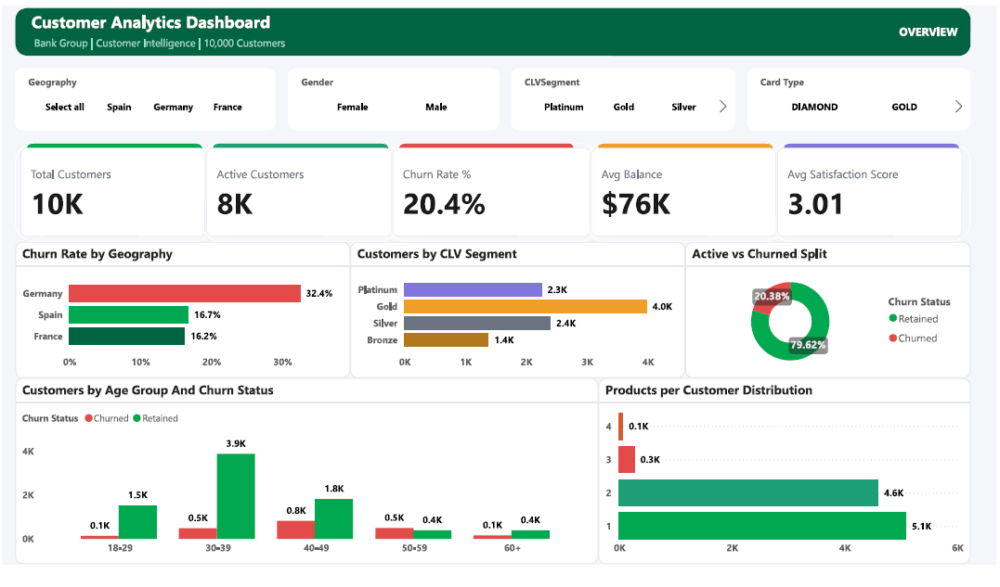
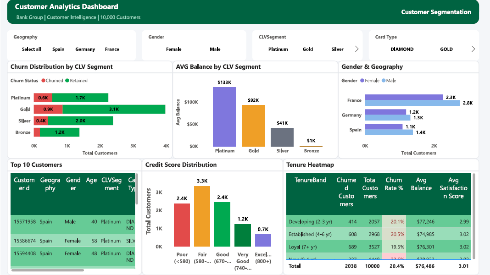
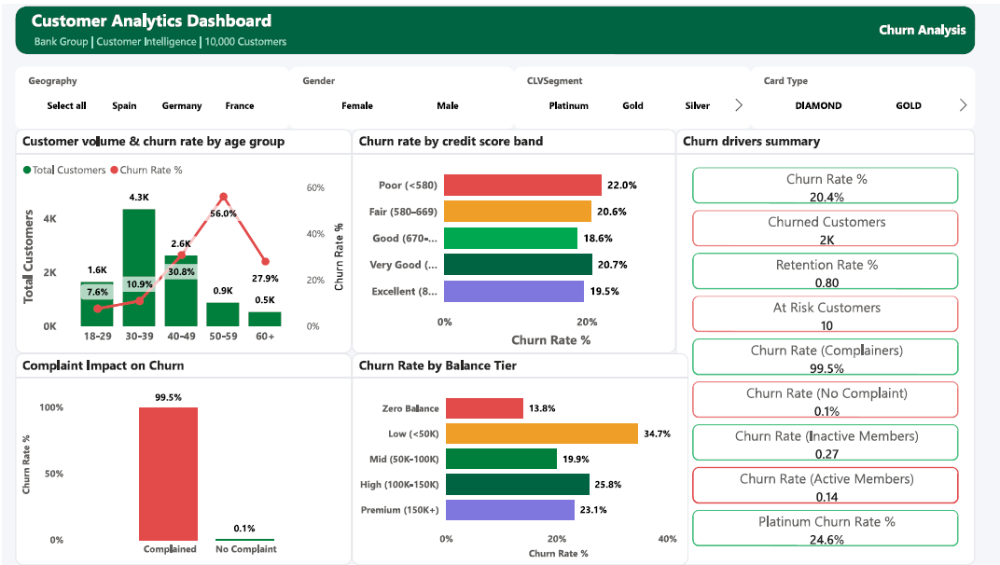
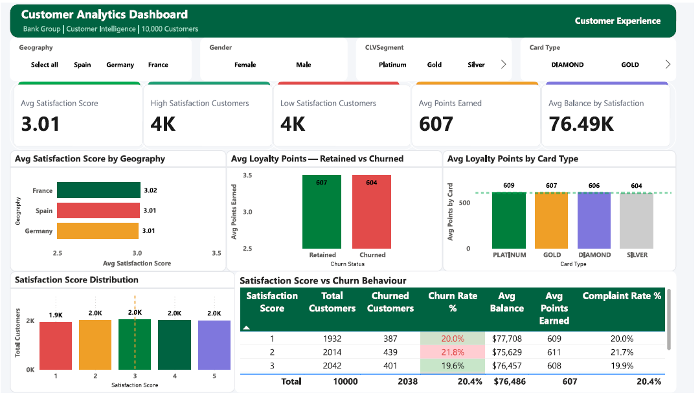

# TD Banking Customer Analytics Dashboard

## Dashboard Preview

### Page 1 — Overview


### Page 2 — Customer Segmentation


### Page 3 — Churn Analysis


### Page 4 — Customer Experience


An industry-level Power BI dashboard built to simulate the customer analytics infrastructure used by retail banking teams at institutions like TD Bank. The dashboard delivers actionable insights across customer segmentation, churn analysis, loyalty, and satisfaction — mirroring the work of a Data Associate in TD's AI2 (Artificial Intelligence, Analytics & Insights) group.

---

## Dashboard Pages

### Page 1 — Overview
Executive summary of the full customer portfolio with KPI cards, geography-level churn analysis, CLV segment distribution, and age-group churn breakdown.

**Key Insight:** Germany drives disproportionate churn at 32.4% vs the portfolio average of 20.4% — flagging a regional retention gap requiring targeted intervention.

### Page 2 — Customer Segmentation
Deep-dive into customer value tiers using a CLV segmentation model (Platinum / Gold / Silver / Bronze) built in Power Query. Includes credit score risk banding, tenure heatmap with conditional formatting, and demographic cross-tabulation.

**Key Insight:** Platinum customers hold an average balance of $133K vs $1K for Bronze — validating the segmentation model and confirming significant revenue concentration at the top tier.

### Page 3 — Churn Analysis
Root-cause analysis of customer attrition across age, credit score, balance tier, complaint history, and engagement level using a dual-axis combo chart and multi-row KPI summary card.

**Key Insight:** Complainers churn at 99.5% vs 0.1% for non-complainers — making complaint history the single strongest churn predictor in the dataset, outweighing credit score, balance tier, and tenure.

### Page 4 — Customer Experience
Satisfaction score distribution, geography-level satisfaction benchmarking, loyalty points analysis by card type, and a satisfaction vs churn behaviour heatmap table.

**Key Insight:** Loyalty points show no meaningful difference between retained (607 avg) and churned (604 avg) customers — suggesting the rewards program alone is insufficient as a retention strategy.

---

## Technical Architecture

### Data Source
- **Dataset:** Bank Customer Churn Dataset (Kaggle) — 10,000 rows, 18 columns
- **Columns used:** CustomerID, CreditScore, Geography, Gender, Age, Tenure, Balance, NumOfProducts, HasCrCard, IsActiveMember, EstimatedSalary, Exited, Complain, Satisfaction Score, Card Type, Point Earned

### Data Model
- Single-table star schema with `CustomerBase` as the fact table
- 5 calculated columns added in Power Query M:
  - `Age Group` — binned into 5 bands (18-29, 30-39, 40-49, 50-59, 60+)
  - `Credit Score Band` — Poor / Fair / Good / Very Good / Excellent
  - `Balance Tier` — Zero / Low / Mid / High / Premium
  - `Tenure Band` — New / Developing / Established / Loyal
  - `CLV Segment` — Platinum / Gold / Silver / Bronze (derived from Balance + EstimatedSalary)
- 4 sort-order columns for correct visual axis sequencing
- `Churn Status` and `Complaint Status` columns for readable label display

### DAX Measures (30+)
Organized in a dedicated `_Measures` table across 5 categories:

**Customer Metrics**
```dax
Churn Rate % = DIVIDE([Churned Customers], [Total Customers], 0)
Active Member Rate % = DIVIDE(CALCULATE(COUNTROWS(CustomerBase), CustomerBase[IsActiveMember] = 1), [Total Customers], 0)
```

**Financial Metrics**
```dax
Avg Balance = AVERAGE(CustomerBase[Balance])
Total Balance = SUM(CustomerBase[Balance])
```

**CLV & Loyalty**
```dax
Platinum Churn Rate % = DIVIDE(CALCULATE(COUNTROWS(CustomerBase), CustomerBase[CLV Segment] = "Platinum", CustomerBase[Exited] = 1), CALCULATE(COUNTROWS(CustomerBase), CustomerBase[CLV Segment] = "Platinum"), 0)
```

**Satisfaction & Complaints**
```dax
Churn Rate (Complainers) = DIVIDE(CALCULATE(COUNTROWS(CustomerBase), CustomerBase[Complain] = 1, CustomerBase[Exited] = 1), CALCULATE(COUNTROWS(CustomerBase), CustomerBase[Complain] = 1), 0)
```

**Churn Analysis**
```dax
At Risk Customers = CALCULATE(COUNTROWS(CustomerBase), CustomerBase[Exited] = 0, CustomerBase[Complain] = 1)
Retention Rate % = 1 - [Churn Rate %]
```

### Design System
- **Primary color:** `#00A950` (TD green)
- **Accent colors:** `#006341` dark green, `#E24B4A` red, `#EF9F27` amber, `#7F77DD` purple
- **Canvas background:** `#F4F6F9`
- **Font:** Segoe UI throughout
- **Conditional formatting:** Applied to Churn Rate %, Avg Balance, Complaint Rate %, and Satisfaction Score columns

---

## Key Findings Summary

| Finding | Metric | Business Implication |
|---|---|---|
| Complaint → Churn | 99.5% churn rate for complainers | Complaint resolution is the #1 retention lever |
| Age Risk | 50-59 age group churns at 56% | Senior customers need targeted retention programs |
| Geography Gap | Germany 32.4% vs France 16.2% | Regional strategy review required for Germany |
| Rewards Gap | Retained 607pts vs Churned 604pts | Loyalty program not differentiating retention |
| Zero Balance | ~100% churn for zero balance customers | Onboarding activation gap — early intervention needed |
| CLV Validation | Platinum $133K vs Bronze $1K avg balance | Segmentation model accurately reflects customer value |

---

## Tools & Technologies

| Tool | Usage |
|---|---|
| Power BI Desktop | Dashboard development, DAX measures, conditional formatting |
| Power Query (M) | Data transformation, calculated columns, sort order logic |
| DAX | 30+ measures across 5 business domains |
| Kaggle | Dataset sourcing |

---

## Project Structure

```
Banking-Customer-Analytics/
│
├── Banking_dashboard.pbix    # Main Power BI dashboard file
├── TD_Banking_Dashboard.pdf      # 4-page dashboard export
├── README.md                             # Project documentation
└── screenshots/
    ├── page1_overview.png
    ├── page2_segmentation.png
    ├── page3_churn_analysis.png
    └── page4_customer_experience.png
```

---

## How to Open

1. Download and install [Power BI Desktop](https://powerbi.microsoft.com/desktop/) (free)
2. Clone or download this repository
3. Open `TD_Banking_Customer_Analytics.pbix` in Power BI Desktop
4. All data is embedded — no external connections required

---

## About

Built as a portfolio project targeting Data Associate / Data Analyst roles in the Canadian financial services sector. Designed to reflect the analytics stack and business questions relevant to TD Bank's AI2 group.

**Author:** Faizan  
**LinkedIn:** [Link](www.linkedin.com/in/faizanfarid-malek-3b1265313)  
**Portfolio:** [Link](https://github.com/faizan97-malek)
